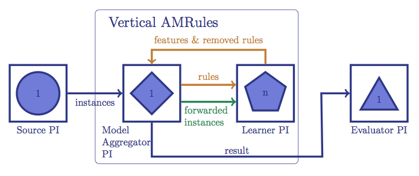
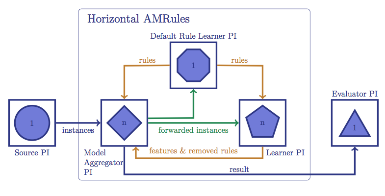

### Adaptive Model Rules Regressor
[Adaptive Model Rules (AMRules)](http://www.ecmlpkdd2013.org/wp-content/uploads/2013/07/251.pdf) is an innovative algorithm for learning regression rules with streaming data. In AMRules, the rule model consists of a set of normal rules and a default rule (a rule with no features). Hoeffding bound is used to define a confidence interval to decide whether to expand a rule. If the ratio of the 2 largest standard deviation reduction (SDR) measure among all potential features of a rule is is within this  interval, the feature with the largest SDR will be added to the rule to expand it. If the default rule is expanded, it will become a normal rule and will be added to the model's rule set. A new default rule is initialized to replace the expanded one. A rule in the set might also be removed if the Page-Hinckley test indicates that its cumulative error exceed a threshold.

### Vertical Adaptive Model Rules Regressor
Vertical Adaptive Model Rules Regressor (VAMR) is the vertical parallel implementation of AMRules in SAMOA. The diagram below shows the components of the implementation.


The _Source PI_ and _Evaluator PI_ are components of the [Prequential Evaluation task](Prequential-Evaluation-Task.html). The _Source PI_ produces the incoming instances while _Evaluator PI_ reads prediction results from VAMR and reports their accuracy and throughput.

The core of VAMR implementation consists of one _Model Aggregator PI_ and multiple _Learner PIs_. Each _Learner PI_ is responsible for training a subset of rules. The _Model Aggregator PI_ manages the rule model (rule set and default rule) to compute the prediction results for incoming instances. It is also responsible for the training the default rule and creation of new rules. 

For each incoming instance from _Source PI_, _Model Aggregator PI_ appies the current rule set to compute the prediction. The instance is also forwarded from _Model Aggregator PI_ to the _Learner PI(s)_ to train those rules that cover this instance. If an instance is not covered by any rule in the set, the default rule will be used for prediction and will also be trained with this instance. When the default rule expands and create a new rule, the new rule will be sent from _Model aggregator PI_ to one of the _Learner PIs_. When the _Learner PIs_ expand or remove a rule, an update message is also sent back to the _Model Aggregator PI_.

The number of _Learner PIs_ can be set with the `-p` option:

```
PrequentialEvaluationTask -l (com.yahoo.labs.samoa.learners.classifiers.rules.VerticalAMRulesRegressor -p 4)
```

### Horizontal Adaptive Model Rules Regressor
Horizontal Adaptive Model Rules Regressor (HAMR) is an extended implementation of VAMR. The components of a [[Prequential Evaluation task|Prequential Evaluation Task]] with HAMR are shown in the diagram below. 


In HAMR, the _Model Aggregator PI_ is replicated, each processes only a partition of the incoming stream from _Source PI_. The default rule is moved from the _Model Aggregator PI_ to a special _Learner PI_, called _Default Rule Learner PI_. This new PI is reposible for both the training and predicting steps for default rule. 

For each incoming instance from _Source PI_, _Model Aggregator PIs_ apply the current rule set to compute the prediction. If the instance is covered by a rule in the set, its prediction is computed by the _Model Aggregator PI_ and, then, it is forwarded to the _Learner PI(s)_ for training. Otherwise, the instance is forwarded to _Default Rule Learner PI_ for both prediction and training. 

Newly created rules are sent from _Default Rule Learner PI_ to all _Model Aggregator PIs_ and one of the _Learner PIs_. Update messages are also sent from _Learner PIs_ to all _Model Aggregator PIs_ when a rule is expanded or removed.

The number of _Learner PIs_ can be set with the `-p` option and the number of _Model Aggregator PIs_ can be set with the `-r` option:

```
PrequentialEvaluationTask -l (com.yahoo.labs.samoa.learners.classifiers.rules.HorizontalAMRulesRegressor -r 4 -p 2)
```

