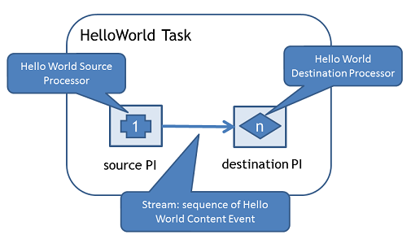

A _task_ is a machine learning related activity such as a specific evaluation for a classifier. For instance the _prequential evaluation_ task is a task that uses each instance first for testing and then for training a model built using a specific classification algorithm. A task corresponds to a topology in SAMOA. 

In this tutorial, we will develop a simple Hello World task.

###  Hello World Task
The Hello World task consists of a source processor, a destination processor with a parallelism hint setting, and a stream that connects the two. The source processor will generate a random integer which will be sent to the destination processor. The figure below shows the layout of Hello World task.



To develop the task, we create a new class that implements the interface `org.apache.samoa.tasks.Task`. For convenience we also implement `com.github.javacliparser.Configurable` which allows to parse command-line options.

The `init` method builds the topology by instantiating the necessary `Processors`, `Streams` and connecting the source processor with the destination processor.

### Hello World Source Processor
We need a source processor which is an instance of `EntranceProcessor` to start a task in SAMOA. In this tutorial, the source processor is `HelloWorldSourceProcessor`. 

The SAMOA runtime invokes the `nextEvent` method of `EntranceProcessor` until its `hasNext` method returns false. Each call to `nextEvent` should return the next `ContentEvent` to be sent to the topology. In this tutorial, `HelloWorldSourceProcessor` sends events of type `HelloWorldContentEvent`.

Here is the relevant code in `HelloWorldSourceProcessor`:

```
    private Random rnd;
    private final long maxInst;
    private long count;

    @Override
    public boolean hasNext() {
        return count < maxInst;
    }

    @Override
    public ContentEvent nextEvent() {
        count++;
        return new HelloWorldContentEvent(rnd.nextInt(), false);
    }
```

We also need to create a new type of `ContentEvent` to hold our data. In this tutorial we call it `HelloWorldContentEvent` and its content is simply an integer.

```
public class HelloWorldContentEvent implements ContentEvent {

    private static final long serialVersionUID = -2406968925730298156L;
    private final boolean isLastEvent;
    private final int helloWorldData;

    public HelloWorldContentEvent(int helloWorldData, boolean isLastEvent) {
        this.isLastEvent = isLastEvent;
        this.helloWorldData = helloWorldData;
    }

    @Override
    public String getKey() {
        return null;
    }

    @Override
    public void setKey(String str) {
        // do nothing, it's key-less content event
    }

    @Override
    public boolean isLastEvent() {
        return isLastEvent;
    }

    public int getHelloWorldData() {
        return helloWorldData;
    }

    @Override
    public String toString() {
        return "HelloWorldContentEvent [helloWorldData=" + helloWorldData + "]";
    }
}
```

### Hello World Destination Processor
The destination processor for SAMOA is pretty straightforward and it will print the data from the event.

```
public class HelloWorldDestinationProcessor implements Processor {

    private static final long serialVersionUID = -6042613438148776446L;
    private int processorId;

    @Override
    public boolean process(ContentEvent event) {
        System.out.println(processorId + ": " + event);
        return true;
    }

    @Override
    public void onCreate(int id) {
        this.processorId = id;
    }

    @Override
    public Processor newProcessor(Processor p) {
        return new HelloWorldDestinationProcessor();
    }
}
```

### Putting It All Together
To put all the components together, we need to go back to class `HelloWorldTask`. First, we need to implement the code for setting up the `TopologyBuilder`. This code is necessary to be able to run on multiple platforms.

```
    @Override
    public void setFactory(ComponentFactory factory) {
        builder = new TopologyBuilder(factory);
        logger.debug("Sucessfully instantiating TopologyBuilder");
        builder.initTopology(evaluationNameOption.getValue());
        logger.debug("Sucessfully initializing SAMOA topology with name {}", evaluationNameOption.getValue());
    }
```

After this method is called we have a functioning builder to get components for our topology. Next, the `init` method is called by SAMOA to start the task.
First we instantiate the source `EntranceProcessor`.
After adding the entrance processor to the topology, we create a stream originating from it. We use the create stream method of `TopologyBuilder`.
Next we create the destination processor and connect it to the stream by using shuffle grouping.
Once we have created all the components, we use the builder to build the topology.

```
    @Override
    public void init() {
        // create source EntranceProcesor
        sourceProcessor = new HelloWorldSourceProcessor(instanceLimitOption.getValue());
        builder.addEntranceProcessor(sourceProcessor);

        // create Stream
        Stream stream = builder.createStream(sourceProcessor);

        // create destination Processor
        destProcessor = new HelloWorldDestinationProcessor();
        builder.addProcessor(destProcessor, helloWorldParallelismOption.getValue());
        builder.connectInputShuffleStream(stream, destProcessor);

        // build the topology
        helloWorldTopology = builder.build();
        logger.debug("Successfully built the topology");
    }
```

### Running It
To run the example in local mode:

```
bin/samoa local target/SAMOA-Local-0.0.1-SNAPSHOT.jar "org.apache.samoa.examples.HelloWorldTask -p 4 -i 100"
```

To run the example in Storm local mode:

```
java -cp $STORM_HOME/lib/*:$STORM_HOME/storm-0.8.2.jar:target/SAMOA-Storm-0.0.1-SNAPSHOT.jar org.apache.samoa.LocalStormDoTask "org.apache.samoa.examples.HelloWorldTask -p 4 -i 1000"
```

All the code for the HelloWorldTask and its components can be found [here](https://github.com/yahoo/samoa/tree/master/samoa-api/src/main/java/org/apache/samoa/examples).
