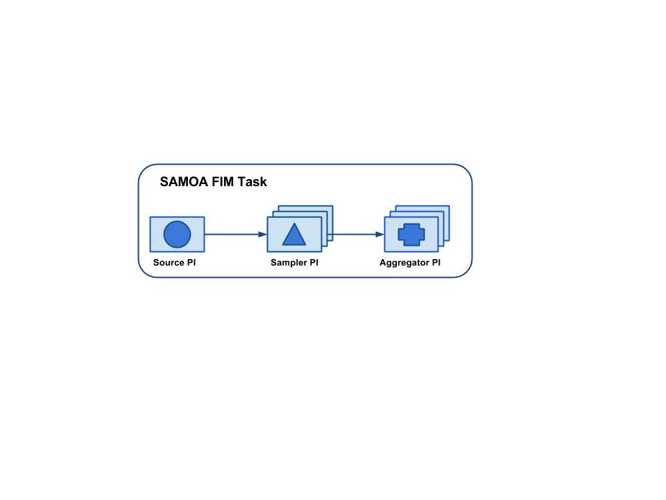

## 1. Introduction
SAMOA takes a micro-batching approach to frequent itemset mining (FIM). It uses [PARMA](https://dl.acm.org/citation.cfm?id=2396776) as a base algorithm for distributed sample-based frequent itemset mining. PARMA provides the guaranty that all the frequent itemsets would be present in the result that it returns.It also returns some false positives. The problem with FIM in streams is that the stream has an evolving nature. The itemsets that were frequent last year may not be frequent this year. To handle this, SAMOA implements [Time Biased Sampling](https://dl.acm.org/citation.cfm?id=1164180) approach. This sampling method depends on a parameter _lambda_ which determines the size of the reservoir sample. This also tells us how much biased the sample would be towards newer itemsets. As PARMA has its own way of determining sample sizes, SAMOA does not allow users to choose _lambda_ and determines its value using the sample size determined by PARMA using the approximation `lambda = 1/sampleSize`. 
## 2. Concepts
SAMOA implements FIM for streams in three processors i.e. StreamSourceProcessor, SamplerProcessor and AggregatorProcessor. The tasks of each of these are explained below.

1. StreamSourceP takes as input the input transaction file. StreamSourceProcessor (Entrance PI) starts sending the transactions randomly to SamplerProcessor instances. The number of SamplerProcessors to instantiate is taken as an argument from the user but is verified by PARMA. PARMA determines this number based on the `epsilon` and `phi` parameters provided by the user. StreamSourceProcessor sends an FPM='yes' command to all the instances of SamplerProcessor after 2M transactions where M=numSamples*sampleSize. After first FPM='yes' command, all later FPM='yes' commands are sent after `fpmGap` transactions which is one of the parameter SAMOA FIM task takes as input.

2. All the instances of SamplerProcessor start building a Time Biased Reservoir Sample in which newer transactions have more weight. Time biased sampling is the default approach but user can provide his own sampler by implementing `samoa.samplers.SamplerInterface`. When a SamplerProcessor receives FPM='yes' command, it starts FIM/FPM on the reservoir irrespective of whether the reservoir is full or not. When it completes, it sends the result item-sets to the AggregatorProcessor with the epoch/batch id. At the end of the result, each SamplerProcessor sends the (“epoch_end”,<epochNum>) message to the AggregatorProcessor.

3. AggregatorProcessor receives the result item-sets from all SamplerProcessors. It maintains different queues for different batch ids and also maintains a count of the number of SamplerProcessors which have finished sending their results for a corresponding batch/epoch. Whenever the `epoch_end` message count becomes equal to the number of instances of SampleProcessor, AggregatorProcessor aggregates the results and stores it in the file system using the output path specified by the user.

In this way, epochs never overlap.If `fpmGap` is small and the StreamSourceProcessor dispatches an FPM='yes' command before the slowest SamplerProcessor finishes FIM on the last epoch, the speed of the global FIM will be equal to the local FIM of the slowest SamplerProcessor. (or AggregatorProcessor if it is slower than the slowest SamplerProcessor)



## 3. How to run
Following is an example of the command used to run the SAMOA FIM task.

```
bin/samoa storm target/SAMOA-Storm-0.0.1-SNAPSHOT.jar "FpmTask -t Myfpmtopology -r (org.apache.samoa.fpm.processors.FileReaderProcessor -i /datasets/freqDataCombined.txt) -m (org.apache.samoa.fpm.processors.ParmaStreamFpmMiner -e .1 -d .1 -f 10 -t 20 -n 23 -p 0.08   -b 100000 -s org.apache.samoa.samplers.reservoir.TimeBiasedReservoirSampler) -w (org.apache.samoa.fpm.processors.FileWriterProcessor -o /output/outPARMA) "
```

Parameters:
To run an FIM task, four parameters are required

* `-t`: Topology name (Can be any name)
* `-r`: The reader class
* `-m`: The miner class
* `-w`: The writer class

In the example above, `FileReaderProcessor` is used as a reader class. It takes only one parameter:

* `-i`: Path to input file

Similarly, `FileWriterProcessor` is used as a writer class. It takes only one parameter:

* `-o`: Path to output file

SAMOA comes with a built-in distributed frequent mining algorithm PARMA as described above but users can plug-in their custom miners by implementing the `FpmMinerInterface`. The built-in PARMA miner can be used with the following parameters:

* `-e`: epsilon parameter for [PARMA](https://dl.acm.org/citation.cfm?id=2396776)
* `-d`: delta parameter for [PARMA](https://dl.acm.org/citation.cfm?id=2396776)
* `-f`: minimum frequency (percentage) of a frequent itemset
* `-t`: maximum length of a transaction
* `-n`: number of samples to maintain
* `-a`: number of aggregators to initiate
* `-p`: phi parameter for [PARMA](https://dl.acm.org/citation.cfm?id=2396776)
* `-i`: path to input file
* `-o`: path to output file
* `-b`: batch size or fpmGap (Number of transactions after which FIM should be performed)
* `-s`: Sampler Class to be used for sampling at each node

## Note
This method is currently unavailable in the master branch of SAMOA due to licensing restriction.
