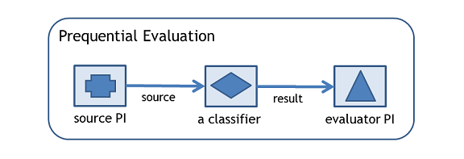

In data stream mining, the most used evaluation scheme is the prequential or interleaved-test-then-train evolution. The idea is very simple: we use each instance first to test the model, and then to train the model. The Prequential Evaluation task evaluates the performance of online classifiers doing this. It supports two classification performance evaluators: the basic one which measures the accuracy of the classifier model since the start of the evaluation, and a window based one which measures the accuracy on the current sliding window of recent instances. 

Examples of Prequential Evaluation task in SAMOA command line when deploying into Storm


```
bin/samoa storm target/SAMOA-Storm-0.0.1-SNAPSHOT.jar "PrequentialEvaluation -d /tmp/dump.csv -i 1000000 -f 100000 -l (classifiers.trees.VerticalHoeffdingTree -p 4) -s (generators.RandomTreeGenerator -c 2 -o 10 -u 10)"
```

Parameters:

* `-l`: classifier to train
* `-s`: stream to learn from
* `-e`: classification performance evaluation method
* `-i`: maximum number of instances to test/train on (-1 = no limit)
* `-f`: number of instances between samples of the learning performance
* `-n`: evaluation name (default: PrequentialEvaluation_TimeStamp)
* `-d`: file to append intermediate csv results to

In terms of SAMOA API, the Prequential Evaluation Task consists of a source `Entrance Processor`, a `Classifier`, and an `Evaluator Processor` as shown below. The `Entrance Processor` sends instances to the `Classifier` using the `source` stream. The classifier sends the classification results to the `Evaluator Processor` via the `result` stream. The `Entrance Processor` corresponds to the `-s` option of Prequential Evaluation, the `Classifier` corresponds to the `-l` option, and the `Evaluator Processor` corresponds to the `-e` option.
 

