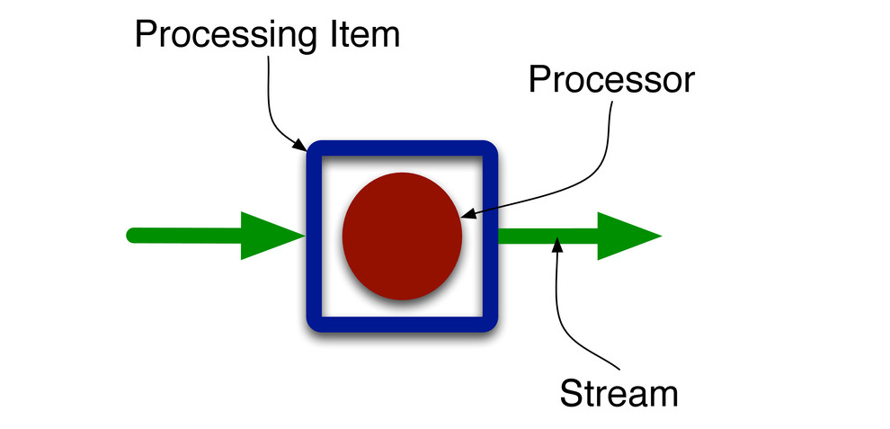

Processor is the basic logical processing unit. All logic is written in the processor. In SAMOA, a Processor is an interface. Users can implement this interface to build their own processors.

### Adding a Processor to the topology

There are two ways to add a processor to the topology.

#### 1. Processor
All physical topology units are created with the help of a `TopologyBuilder`. Following code snippet shows how to add a Processor to the topology.
```
Processor processor = new ExampleProcessor();
builder.addProcessor(processor, paralellism);
```
`addProcessor()` method of `TopologyBuilder` is used to add the processor. Its first argument is the instance of a Processor which needs to be added. Its second argument is the parallelism hint. It tells the underlying platforms how many parallel instances of this processor should be created on different nodes.

#### 2. Entrance Processor
Some processors generates their own streams, and they are used as the source of a topology. They connect to external sources, pull data and provide it to the topology in the form of streams.
All physical topology units are created with the help of a `TopologyBuilder`. The following code snippet shows how to add an entrance processor to the topology and create a stream from it.
```
EntranceProcessor entranceProcessor = new EntranceProcessor();
builder.addEntranceProcessor(entranceProcessor);
Stream source = builder.createStream(entranceProcessor);
```

### Preview of Processor
```
package samoa.core;
public interface Processor extends java.io.Serializable{
	boolean process(ContentEvent event);
	void onCreate(int id);
	Processor newProcessor(Processor p);
}
```
### Methods

#### 1. `boolean process(ContentEvent event)`
Users should implement the three methods shown above. `process(ContentEvent event)` is the method in which all processing logic should be implemented. `ContentEvent` is a type (interface) which contains the event. This method will be called each time a new event is received. It should return `true` if the event has been correctly processed, `false` otherwise.

#### 2. `void onCreate(int id)` 
is the method in which all initialization code should be written. Multiple copies/instances of the Processor are created based on the parallelism hint specified by the user. SAMOA assigns each instance a unique id which is passed as a parameter `id` to `onCreate(int it)` method of each instance.

#### 3. `Processor newProcessor(Processor p)` 
is very simple to implement. This method is just a technical overhead that has no logical use except that it helps SAMOA in some of its internals. Users should just return a new copy of the instance of this class which implements this Processor interface. 

### Preview of EntranceProcessor
```
package org.apache.samoa.core;

public interface EntranceProcessor extends Processor {
    public boolean isFinished();
    public boolean hasNext();
    public ContentEvent nextEvent();
}
```
### Methods

#### 1. `boolean isFinished()`
returns whether to expect more events coming from the entrance processor. If the source is a live stream this method should return always `false`. If the source is a file, the method should return `true` once the file has been fully processed.

#### 2. `boolean hasNext()` 
returns whether the next event is ready for consumption. If the method returns `true` a subsequent call to `nextEvent` should yield the next event to be processed. If the method returns `false` the engine can use this information to avoid continuously polling the entrance processor.

#### 3. `ContentEvent nextEvent()` 
is the main method for the entrance processor as it returns the next event to be processed by the topology. It should be called only if `isFinished()` returned `false` and `hasNext()` returned `true`.

### Note
All state variables of the class implementing this interface must be serializable. It can be done by implementing the `Serializable` interface. The simple way to skip this requirement is to declare those variables as `transient` and initialize them in the `onCreate()` method. Remember, all initializations of such transient variables done in the constructor will be lost.
