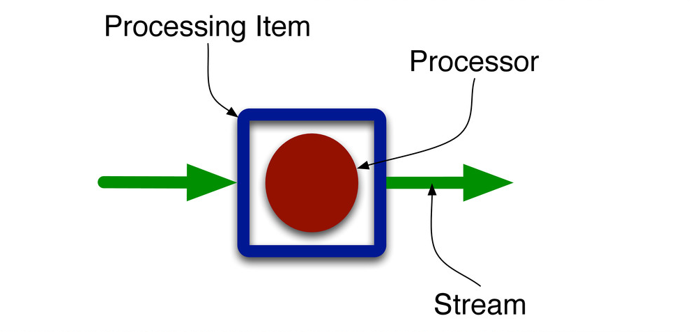

Apache SAMOA allows users to write their stream processing algorithms in an easy and platform independent way. SAMOA defines its own topology which is very intuitive and simple to use. Currently SAMOA has the following basic topology elements.

1. [Processor](Processor.html)
1. [Content Event](Content-Event.html)
1. [Stream](Stream.html)
1. [Task](Task.html)
1. [Topology Builder](Topology-Builder.html)
1. [Learner](Learner.html)
1. **Advanced topic**: [Processing Item](Processing-Item.html)

Processor and Content Event are the logical units to build your algorithm, Stream and Task are the physical units to wire the various pieces of your algorithm, whereas Topology Builder is an administrative unit that provides bookkeeping services. Learner is the base interface for learning algorithms. Processing Items are internal wrappers for Processors used inside SAMOA.

