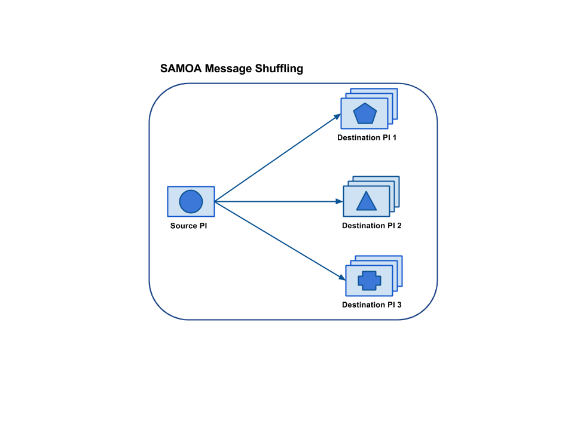
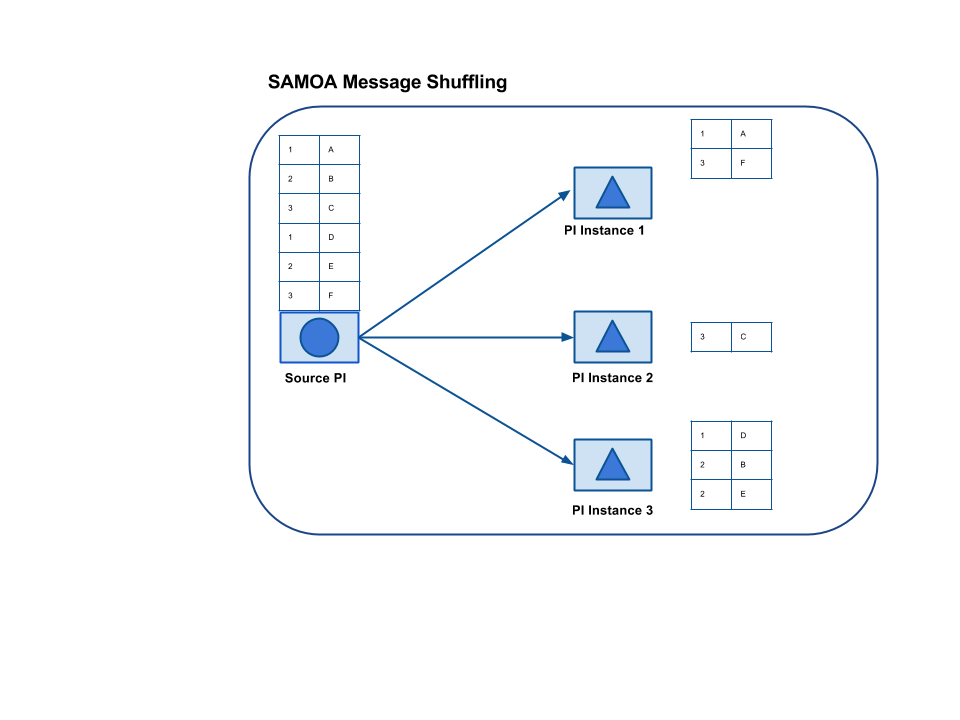
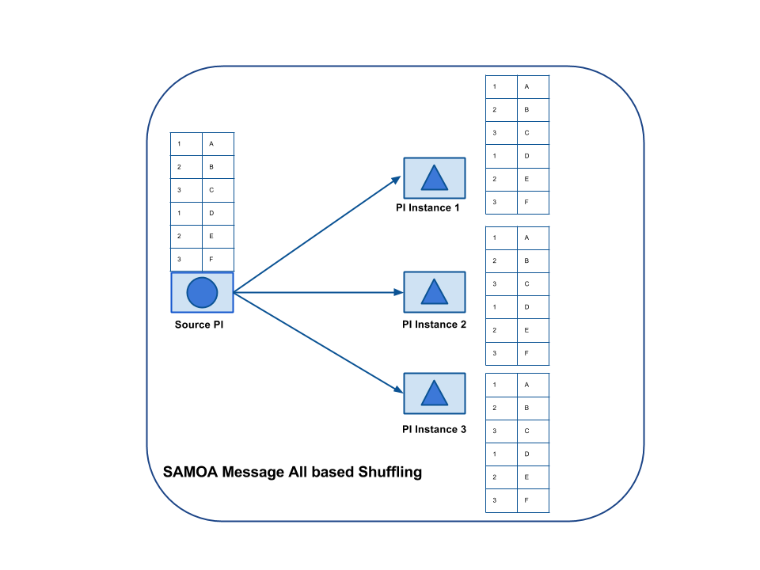

A stream is a physical unit of SAMOA topology which connects different Processors with each other. Stream is also created by a `TopologyBuilder` just like a Processor. A stream can have a single source but many destinations. A Processor which is the source of a stream, owns the stream.

###1. Creating a Stream
The following code snippet shows how a Stream is created:

```
builder.initTopology("MyTopology");
Processor sourceProcessor = new Sampler();
builder.addProcessor(samplerProcessor, 3);
Stream sourceDataStream = builder.createStream(sourceProcessor);
```

###2. Connecting a Stream
As described above, a Stream can have many destinations. In the following figure, a single stream from sourceProcessor is connected to three different destination Processors each having three instances.



SAMOA supports three different ways of distribution of messages to multiple instances of a Processor.
####2.1 Shuffle
In this way of message distribution, messages/events are distributed randomly among various instances of a Processor. 
Following figure shows how the messages are distributed.

Following code snipped shows how to connect a stream to a destination using random shuffling.

```
builder.connectInputShuffleStream(sourceDataStream, destinationProcessor);
```
####2.2 Key
In this way of message distribution, messages with same key are sent to same instance of a Processor.
Following figure illustrates key-based distribution.

Following code snippet shows how to connect a stream to a destination using key-based distribution.

```
builder.connectInputKeyStream(sourceDataStream, destinationProcessor);
```
####2.3 All
In this way of message distribution, all messages of a stream are sent to all instances of a destination Processor. Following figure illustrates this distribution process.

Following code snippet shows how to connect a stream to a destination using All-based distribution.

```
builder.connectInputAllStream(sourceDataStream, destinationProcessor);
```
