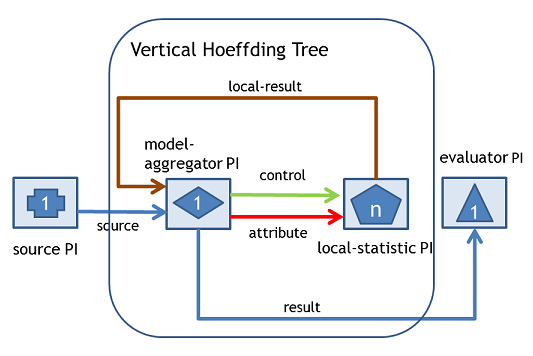

Vertical Hoeffding Tree (VHT) classifier is a distributed classifier that utilizes vertical parallelism on top of the Very Fast Decision Tree (VFDT) or Hoeffding Tree classifier.

### Very Fast Decision Tree (VFDT) classifier
[Hoeffding Tree or VFDT](http://doi.acm.org/10.1145/347090.347107) is the standard decision tree algorithm for data stream classification. VFDT uses the Hoeffding bound to decide the minimum number of arriving instances to achieve certain level of confidence in splitting the node. This confidence level determines how close the statistics between the attribute chosen by VFDT and the attribute chosen by decision tree for batch learning.

For a more comprehensive summary of VFDT, read chapter 3 of [Data Stream Mining: A Practical Approach](http://heanet.dl.sourceforge.net/project/moa-datastream/documentation/StreamMining.pdf).

### Vertical Parallelism 
Vertical Parallelism is a parallelism approach which partitions the instances in term of attribute for parallel processing. Vertical-parallelism-based decision tree induction processes the partitioned instances (which consists of subset of attribute) to calculate the information-theoretic criteria in parallel. For example, if we have instances with 100 attributes and we partition the instances into 5 portions, we will have 20 attributes per portion. The algorithm processes the 20 attributes in parallel to determine the "local" best attribute to split and combine the parallel computation results to determine the "global" best attribute to split and grow the tree. 

For more explanation about available parallelism types for decision tree induction, you can read chapter 4 of [Distributed Decision Tree Learning for Mining Big Data Streams](http://yahoo.github.io/samoa/SAMOA-Developers-Guide-0-0-1.pdf), the Developer's Guide of SAMOA.  

### Vertical Hoeffding Tree (VHT) classifier
VHT is implemented using the SAMOA API. The diagram below shows the implementation:

The _source Processor_ and the _evaluator Processor_ are components of the [prequential evaluation task](Prequential-Evaluation-Task) in SAMOA. The _model-aggregator Processor_ contains  the decision tree model. It connects to _local-statistic Processor_ via _attribute_ stream and _control_ stream. The _model-aggregator Processor_ splits instances based on attribute and each _local-statistic Processor_ contains local statistic for attributes that assigned to it. The _model-aggregator Processor_ sends the split instances via attribute stream and it sends control messages to ask _local-statistic Processor_ to perform computation via _control_ stream. Users configure _n_, which is the parallelism level of the algorithm. The parallelism level is translated into the number of local-statistic Processors in the algorithm.

The _model-aggregator Processor_ sends the classification result via _result_ stream to the _evaluator Processor_ for the corresponding evaluation task or other destination Processor. The _evaluator Processor_ performs an evaluation of the algorithm showing accuracy and throughput. Incoming instances to the _model-aggregator Processor_ arrive via _source_ stream. The calculation results from local statistic arrive to the _model-aggregator Processor_ via _computation-result_ stream.

For more details about the algorithms (i.e. pseudocode), go to section 4.2 of [Distributed Decision Tree Learning for Mining Big Data Streams](http://yahoo.github.io/samoa/SAMOA-Developers-Guide-0-0-1.pdf), the Developer's Guide of SAMOA.  
